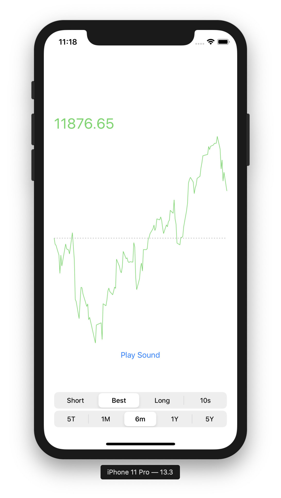
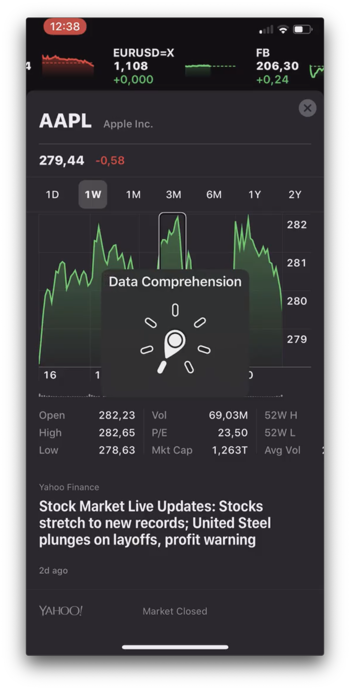

# Audiograph
Audio-Feedback on Charts for visually impaired Users


[](LICENSE)

<a href="Media/Screenshot.png"></a>


**This Readme is far from being complete!** I just added the most basic information about using it with a dependency manager. Currently, CocoaPods is not supported, as this is a private repo. Examples are working but not well documented here, yet.  
I'll work on that as soon as I got some feedback about using it :)

## Background
iOS 13 introduced an awsome way to provide stocks-charts to visually impaired users. Using a custom accessibility-rotor they are providing spoken chart analysis and an audiograph that renders the chart by using audio. That's the most accurate way of describing a chart that otherwise would only available visually.  
Take a look at the following video if you haven't tried it out yourself:

<a href="https://anerma.de/uploads/iOS_13_Audiograph.mp4"></a>


## Example
The example app provides many things related to presenting a cool chart. I wrote about the chart in my [blog](https://anerma.de/blog/tear-down-trade-republic-charts). However, this project is about accessibility.  
You can find everything related to accessibility in the file `ChartView+Accessibility`.

To run the example project, clone this repo, and open iOS Example.xcworkspace from the iOS Example directory.

## Points to improve on the next Iteration
* [ ] Computing samples on a background queue
* [ ] Removing debug print statements
* [ ] Design a cool icon (because all OS projects need a logo, obviously)

A version 1.0 will not launch until those points are addressed.

## Usage
After stating `import Audiograph` you keep a strong reference to it
```Swift
let audiograph = Audiograph()
```
Now you are ready to play the audiograph by calling:
```swift
audiograph.play(graphContent: points)
```
The argument is of type `[CGPoint]` and should be the same points you are using to draw your UI.

You now can trigger the Audiograph at any time you like. However, it is recommended to use it as accessibility feature.  
There are several ways to provide it to your users as such. One way is to play it as soon as the chart-view gets activated by the Accessibility System.
```swift
func setupAccessibility() {
    isAccessibilityElement = true
    shouldGroupAccessibilityChildren = true

    accessibilityTraits = .button
    accessibilityLabel = "Chart"
    accessibilityHint = "Double tap for audiograph."
}
override func accessibilityActivate() -> Bool {
    // Remove label and hint because they are read when activated. That intefers with audiograph.
    accessibilityLabel = ""
    accessibilityHint = ""

    playAudiograph()
    return true
}

@objc private func playAudiograph() {
    audiograph.play(graphContent: points)
}
```

When the view loses focus, you might want to restore the accessibility attributes:
```swift
override func accessibilityElementDidLoseFocus() {
    // Restore usual accessibility attributes.
    accessibilityLabel = "Chart"
    accessibilityHint = "Double tap for audiograph."
}
```

This project is still young. When you find a better way of playing Audiograph in response to accessibility events *please* update that file or [tell me](https://twitter.com/Klaarname/)!

## Installation

Add this to your project using Swift Package Manager. In Xcode that is simply: File > Swift Packages > Add Package Dependency... and you're done. Alternative installations options are shown below for legacy projects.

### CocoaPods

If you are already using [CocoaPods](http://cocoapods.org), just add 'Audiograph' to your `Podfile` then run `pod install`.

### Carthage

If you are already using [Carthage](https://github.com/Carthage/Carthage), just add to your `Cartfile`:

```ogdl
github "Tantalum73/Audiograph" ~> 0.1
```

Then run `carthage update` to build the framework and drag the built `Audiograph`.framework into your Xcode project.


## Author

**Andreas Neusüß**

I would love to hear feedback from you. You can send me an email or contact me on [Twitter](https://twitter.com/Klaarname/)! 😊


## License

Audiograph is available under the MIT license. See [the LICENSE file](LICENSE) for more information.
