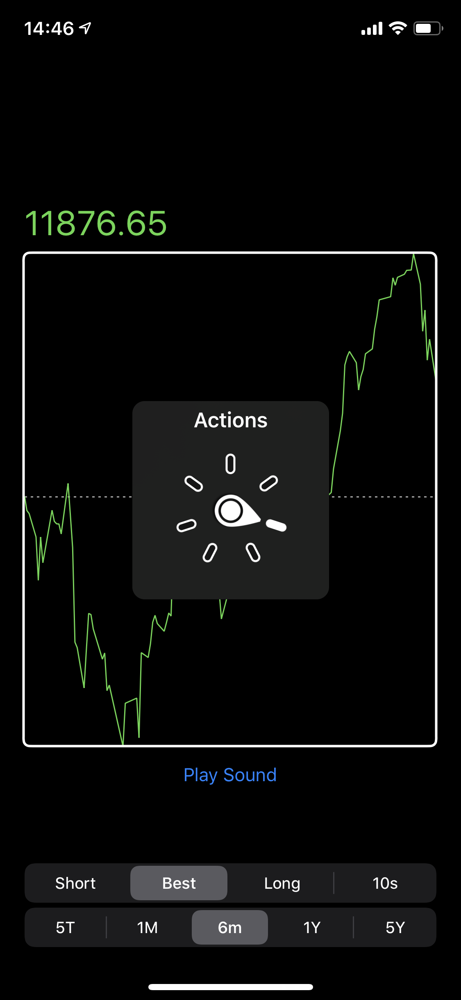

Audio-Feedback on Charts for visually impaired Users


[](LICENSE)

**Currently, CocoaPods is not supported, as this is a private repo.**  
**Please** provide feedback on the API, its integration, documentation and examples! :)

## Background
iOS 13 introduced an awesome way to provide stocks-charts to visually impaired users. Using a custom accessibility-rotor they are providing spoken chart analysis and an audiograph that renders the chart by using audio. That's the most accurate way of describing a chart that otherwise would only be available visually.  
Take a look at the following video if you haven't tried it out yourself:

<a href="https://anerma.de/uploads/iOS_13_Audiograph.mp4"></a>

## Audiograph
Unfortunately there is no public API from Apple that enables developers to implement it in their apps (yet). I think that charts can provide a great way of presenting information, but we should not limit their use to those without impairments.  
This is where Audiograph comes into play:

<a href="https://anerma.de/uploads/Audiograph_Demo_small.mp4"></a>

## Example
The example app provides many things related to presenting a cool chart. I wrote about the chart in my [blog](https://anerma.de/blog/tear-down-trade-republic-charts). However, this project is about accessibility.  
You can find everything related to accessibility in the file `ChartView+Accessibility.swift`.

To run the example project, clone this repo, and open iOS Example.xcworkspace from the iOS Example directory.

## Usage
After stating `import Audiograph` you can initialize Audiograph with localized phrases. Those phrases will improve  the experience of your users.  
They describe how the Audiograph can be started *(`accessibilityIndicationTitle`, eg. "Play Audiograph")* and what phrase should indicate that the playback has ended *(`completionIndicationUtterance`, eg. "Complete")*.  
You need to store a strong reference to `Audiograph`.

```swift
let audiograph: Audiograph = {
    let completion = NSLocalizedString("CHART_ACCESSIBILITY_AUDIOGRAPH_COMPLETION_PHREASE", comment: "This phrase is read when the Audiograph has completed describing the chart using audio. Should be something like 'complete'.")
    let indication = NSLocalizedString("CHART_PLAY_AUDIOGRAPH_ACTION", comment: "The title of the accessibility action that starts playing the audiograph. 'Play audiograph.' for example.")
    let localizations = AudiographLocalizations(completionIndicationUtterance: completion, accessibilityIndicationTitle: indication)

    return Audiograph(localizations: localizations)
}()
```

Now you have multiple options to play the Audiograph.
1. Use a custom accessibility action
2. Call `.play(graphContent: )` directly, the argument is of type `[CGPoint]` and should be the same points you are using to draw your UI.

The second option is only encouraged if you exactly know when to play the Audiograph. In any other cases, option one will work best for you.

In order to make use of the system, start making your chart conform to `AudiographPlayable`.  
When doing so, the view can deliver data points by setting `graphContent` to the `[CGPoint]`s that are also used to draw the UI.

When you configure the accessibility attributes, make sure to use `audiograph.createCustomAccessibilityAction(for: )` as a custom action:

```swift
extension ChartView: AudiographPlayable {
    var graphContent: [CGPoint] {
        scaledPoints
    }
    var accessibilityLabelText: String { "Chart, price over time" }
    var accessibilityHintText: String { "Actions for playing Audiograph available." }

    func setupAccessibility() {
        isAccessibilityElement = true
        shouldGroupAccessibilityChildren = true
        accessibilityLabel = accessibilityLabelText
        accessibilityHint = accessibilityHintText

        accessibilityCustomActions = [audiograph.createCustomAccessibilityAction(for: self)]
    }
}
```

You can find examples on how to configure it in the file "ChatzChartView+Accessibility.swift"

This project is still young. When you find a better way of playing Audiograph in response to accessibility events *please* update that file or [tell me](https://twitter.com/Klaarname/)!

## Configuration

All of the mentioned customizations need to be set before a call to `play(graphContent:completion:)` starts the playback.

### Playback-Duration
Specifies the amount of seconds the audio should be played. Possible options are:
```swift
public enum PlayingDuration {
    case short
    case recommended
    case long
    case exactly(DispatchTimeInterval)
}
```
* `.short`: The most abbreviated way to present the Audiograph.
* `.recommended`: The best tradeoff between playback duration and maximum length to avoid skipping data points.
* `.long`: The maximum duration. Depending on your input it might produce a great deal of samples which introduces memory pressure.
* `.exactly`: Specify the exact amount of time the playback should take. The longer it takes the more samples need to be stored in memory: *With great power comes great responsibility.*

The above options (with exception of `.exactly`) act as **suggestions only**. The final Audiograph might take longer depending on the input. It is ensured that each segment has enough time to play so that the user is able to hear the difference between two points of the graph.  
However, some data points might be dropped in order to keep the playback duration within a reasonable range.

### Frequencies
The input points are scaled so that they fit in between a minimum and a maximum frequency. The Audiograph's lowest frequency is specified in `minFrequency`, its maximum frequency is stored in `maxFrequency`.  
Those frequencies can be altered depending on the use-case.

### Volume
The volume is configurable by setting `volumeCorrectionFactor`. That factor is applied to the final volume of the sound.  
It might be convenient to specify `0` when running unit tests. If the use-case requires higher volumes, that factor might be set up to a value of `2`.

### Completion Phrase
The video above was ended by a Siri-voice saying "complete". The parameter `completionIndicationUtterance` controls what phrase the system says after playing Audiograph was completed.  
Even though this phrase can be set to an empty string, it is recommended to inform the user that there is nothing more to expect. However, it must be set by the application because a Swift-Package can not contain localization files at the time of the development.


## Installation

### Swift Package-Manager

Add this to your project using Swift Package Manager. In Xcode that is simply: File > Swift Packages > Add Package Dependency... and you're done. Alternative installations options are shown below for legacy projects.

### CocoaPods

If you are already using [CocoaPods](http://cocoapods.org), just add 'Audiograph' to your `Podfile` then run `pod install`.

### Carthage

If you are already using [Carthage](https://github.com/Carthage/Carthage), just add to your `Cartfile`:

```ogdl
github "Tantalum73/Audiograph" ~> 0.1
```

Then run `carthage update` to build the framework and drag the built `Audiograph`.framework into your Xcode project.


## Author

**Andreas Neusüß**

I would love to hear feedback from you. You can send me an email or contact me on [Twitter](https://twitter.com/Klaarname/)! 😊


## License

Audiograph is available under the MIT license. See [the LICENSE file](LICENSE) for more information.
